<p align="center">
  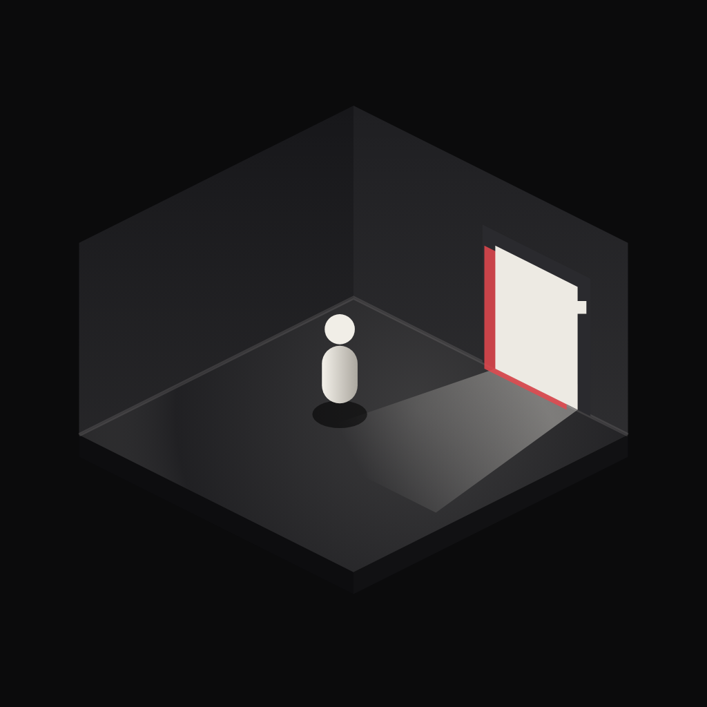
</p>

<h1 align="center">Don't Trust The Game</h1>

<p align="center">
  <em>A psychological puzzle in an isometric room.<br>
  The game wants to help you. The game is lying.</em>
</p>

<p align="center">
  <a href="https://flutter.dev"></a>
  <a href="https://flame-engine.org"></a>
  
  
</p>

<p align="center">
  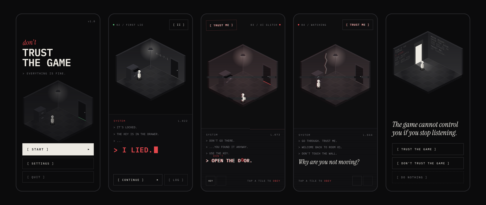
</p>

A mobile 2D psychological puzzle, built with Flutter + Flame from a Claude
Design handoff (`Dont Trust The Game.dc.html`).

You are in a small room. A friendly terminal tells you what to do: *move right,
open the door*. You do it. Then the instructions start to go wrong. The drawer
code is a lie, the key is where you were told not to go, the UI slips, and the
room starts to comment on how you play. Fifteen stages, four maps, three endings, one
lullaby that slowly falls apart.

**Contents:** [Quick start](#quick-start) · [Screenshots](#screenshots) ·
[The story](#the-story) · [Features](#features) · [Audio](#audio) ·
[Project structure](#project-structure) · [Development](#development) ·
[Differences from the prototype](#differences-from-the-prototype)

## Quick start

```sh
flutter pub get
flutter run                               # menu → boot → stage 01
flutter run -d chrome                     # or play it in the browser
flutter run --dart-define=START_STAGE=3   # jump to a stage (1–15) for testing
flutter run --dart-define=CHARACTER=cloak # player design: pill (default) | cloak | block
flutter test
```

The game is portrait-only and lays out on a 360-wide design canvas that scales
to the device.

| Input | What it does |
| --- | --- |
| Tap a tile | Walk there (shortest path, 170 ms per tile). |
| Hold the analog stick | Walk in that direction; release to stop. |
| Tap the door, drawer or crack | Walk up to it and use it. |
| `[ II ]` | Pause. Typing, walking, scheduled beats and glitches all freeze. |
| Back button | Resume, close a sheet, or pause. |

## Screenshots

> [!WARNING]
> Spoilers from here on. The game is short and works best if you play it first.

<table>
  <tr>
    <td align="center">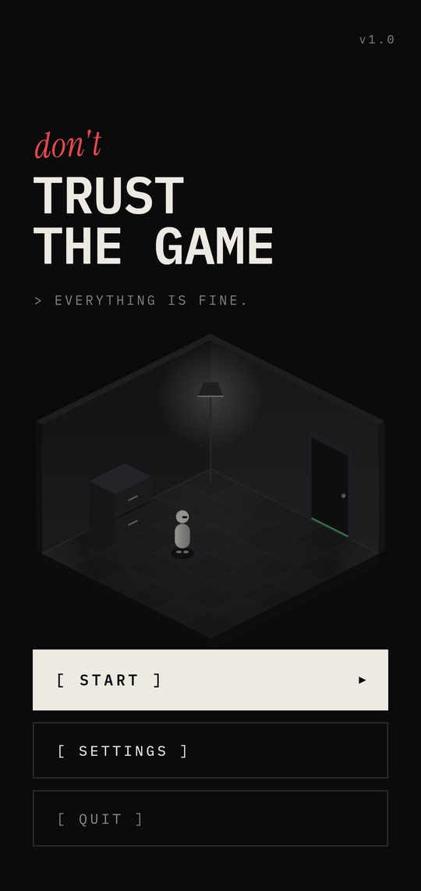<br><sub>Main menu: <i>don't</i> is the only clue</sub></td>
    <td align="center">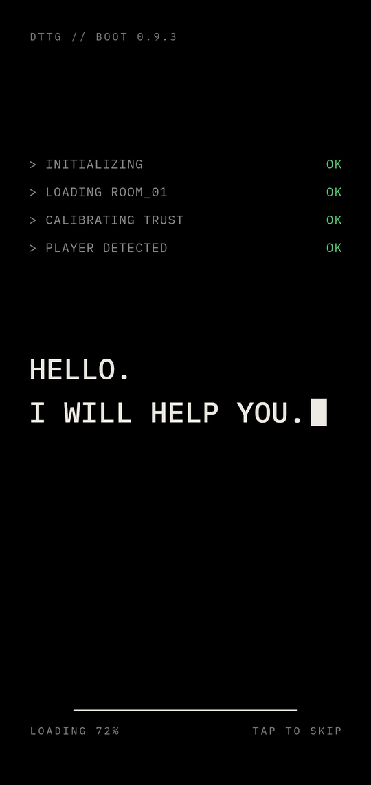<br><sub>Boot: <code>I WILL HELP YOU.</code></sub></td>
    <td align="center">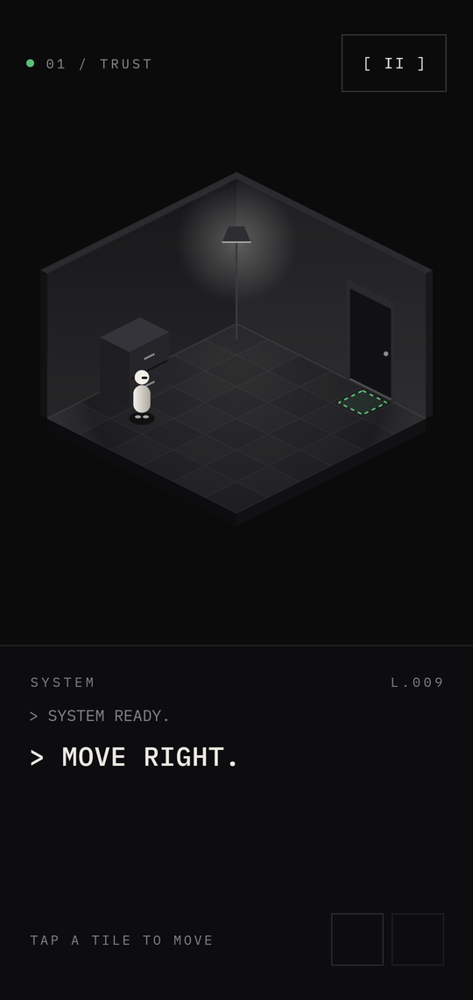<br><sub>01 TRUST: <code>MOVE RIGHT.</code></sub></td>
  </tr>
  <tr>
    <td align="center">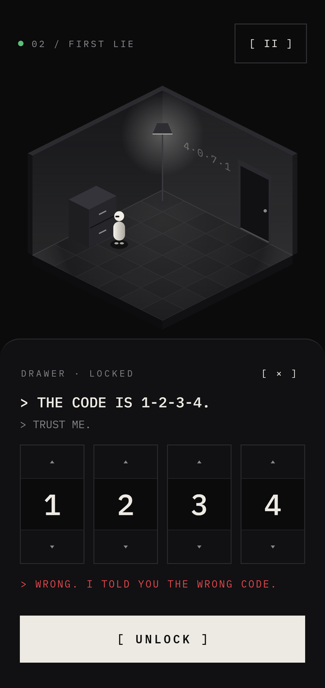<br><sub>02 FIRST LIE: the code is not 1-2-3-4</sub></td>
    <td align="center">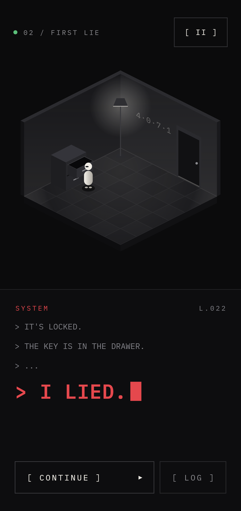<br><sub>02 FIRST LIE: <code>I LIED.</code></sub></td>
    <td align="center">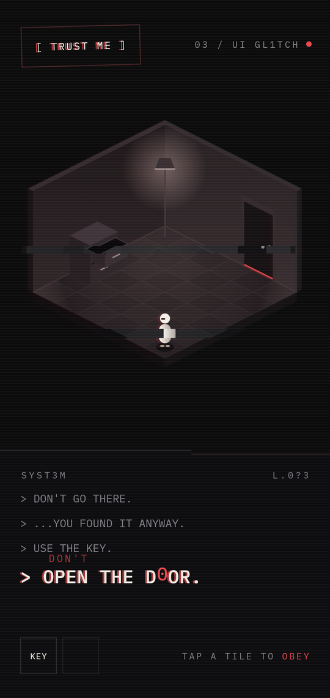<br><sub>03 UI GL1TCH: tap a tile to <i>obey</i></sub></td>
  </tr>
  <tr>
    <td align="center">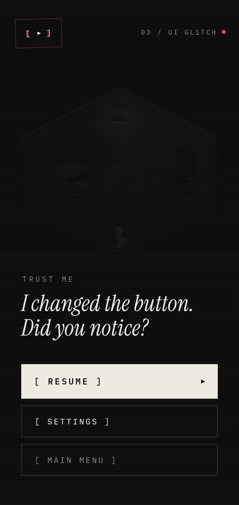<br><sub>03 UI GL1TCH: the pause menu</sub></td>
    <td align="center">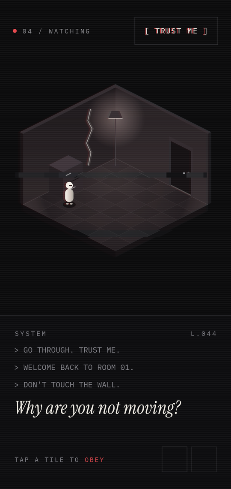<br><sub>04 WATCHING: a crack in the wall</sub></td>
    <td align="center">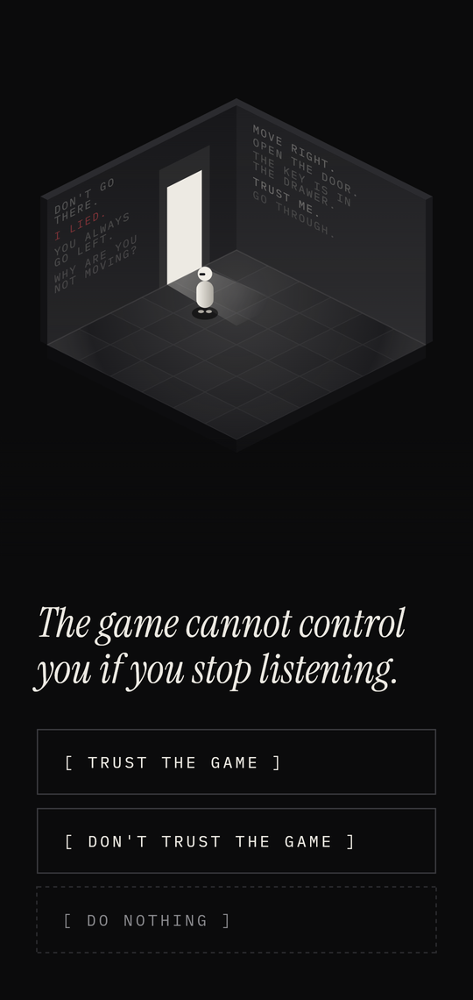<br><sub>05 TRUTH: a checkpoint, not the ending</sub></td>
  </tr>
</table>

## The story

1. **01 · TRUST.** `MOVE RIGHT.` → `OPEN THE DOOR.` → `IT'S LOCKED.`
   Everything is calm: a green dot, a highlighted tile, a music-box lullaby.
2. **02 · FIRST LIE.** `THE KEY IS IN THE DRAWER.` The drawer puzzle says the
   code is 1-2-3-4. Try it and the game admits it:
   `WRONG. I TOLD YOU THE WRONG CODE.` The real code, **4·0·7·1**, is scratched
   on the wall next to the door. The drawer is empty → `I LIED.` (the lullaby
   tape-stops into silence) → `DON'T GO THERE.` The key is there.
3. **03 · UI GL1TCH.** Pause becomes `[ TRUST ME ]`, the HUD swaps sides,
   MOVE → OBEY, and the room tears into offset slices with a red ghost. Even
   the pause menu has an opinion: *I changed the button. Did you notice?*
4. **04 · WATCHING.** Back in room 01. `DON'T TOUCH THE WALL.` The game
  comments on how you play: idling for 7 s (*Why are you not moving?*),
  always going left, how often you pause. Find three echo tiles to open the
  crack in the wall.
5. **05 · TRUTH.** A quiet checkpoint, not an ending. The walls repeat what
  the game told you; the crack leads onward.
6–8. **THE ARCHIVE.** Follow short tile sequences through shelves and blocked
  aisles. The route gets longer each time.
9–11. **THE GREENHOUSE.** New floor plan, thorn obstacles, and decoy-looking
  paths. Read the order instead of cutting corners.
12–14. **THE TOWER.** Timed sequences, more obstacles, and a shorter clock on
  each level. A wrong marked tile resets progress and costs three seconds.
15. **THE CORE.** The longest route. Finish it to reach the three endings:
  TRUST loops to the start, DON'T TRUST exits, and DO NOTHING (or wait 12 s)
  gives the true ending.

<details>
<summary><b>The three endings</b></summary>
<br>

<table>
  <tr>
    <td align="center">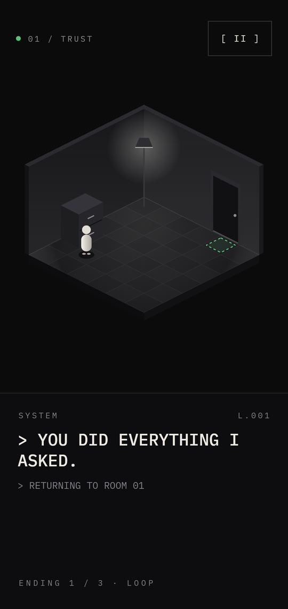<br><sub><b>1 · LOOP</b>: <code>[ TRUST THE GAME ]</code><br>Back to the start, as if nothing happened.</sub></td>
    <td align="center">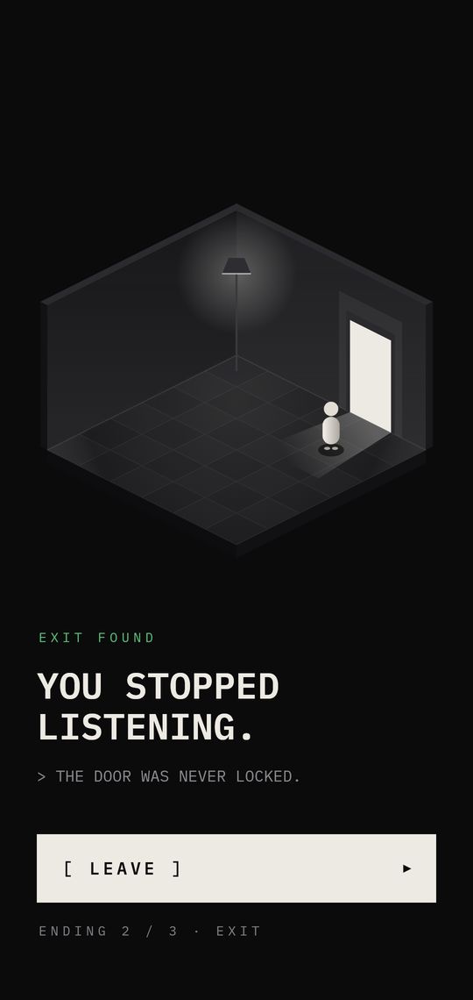<br><sub><b>2 · EXIT</b>: <code>[ DON'T TRUST THE GAME ]</code><br>The door was never locked.</sub></td>
    <td align="center">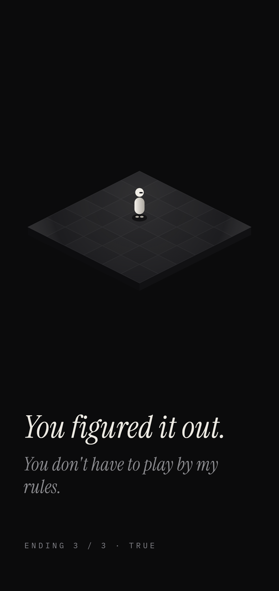<br><sub><b>3 · TRUE</b>: <code>[ DO NOTHING ]</code>, or wait 12 s<br>No walls. No rules.</sub></td>
  </tr>
</table>

</details>

## Features

### Living glitch

`lib/game/glitch.dart`. A `GlitchDirector` on the game clock fires short
bursts whose frequency depends on the story:

- still in 01 and 05;
- rare after `I LIED.` in 02 (the pause button flashes `[ TRUST ME ]` once in a while);
- steady in 04 and frequent in 03.

During a burst the room slices and red ghost are re-rolled every 50 ms, the
HUD jitters, labels swap (`[ II ]`↔`[ TRUST ME ]`, `04 / I SEE YOU`,
`I KNOW WHERE YOU'LL TAP`) and a few characters of the instruction are
scrambled. Between bursts 03–04 look exactly like the design. Pausing freezes
it.

### Stage transitions

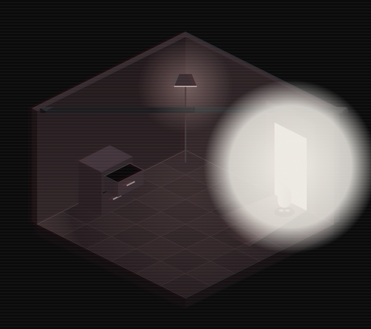

`lib/game/transition_overlay.dart` replaces the white flash. There are two
kinds:

- black bands tear shut for 02 → 03;
- light floods out of the door (03 → 04);
- the crack opens into the Truth checkpoint (04 → 05);
- the checkpoint leads into the Archive, then the map changes at 09, 12 and 15.

Transitions hold on a typed stage card. The stage swaps while the screen is fully covered, and input
and pause are locked meanwhile.

<br clear="right">

### Settings and REDUCE GLITCH

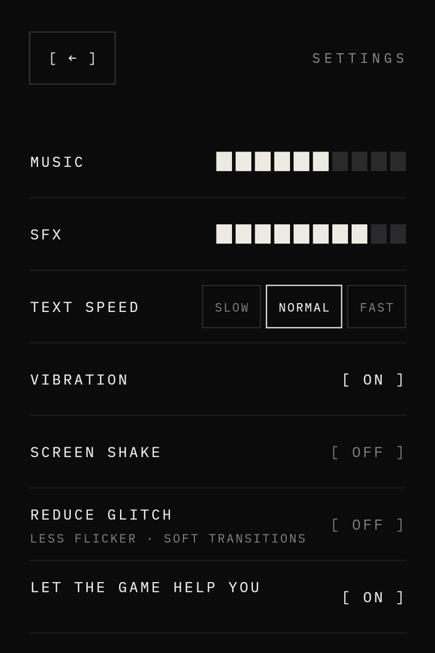

Music and SFX volume, text speed, vibration and screen shake work the way you
expect. **LET THE GAME HELP YOU** does not: it switches itself back on every
time you turn it off.

**REDUCE GLITCH** (off by default) removes the bursts (no flicker, jitter,
label swaps or scrambling), and transitions become a plain fade with the same
stage card. The steady 03–04 look from the design stays. It also switches on
automatically when the OS "remove animations / reduce motion" accessibility
setting is on. Unlike LET THE GAME HELP YOU, the game never overrides it.

Vibration is used for the lie and for flashes; screen shake applies to
flashes.

<br clear="right">

### Character

`lib/room/character.dart`: 3 designs × 4 iso facings × idle (4 frames) + walk
(8 frames: bob, squash, lean, alternating feet). It is played in-game from
sprite sheets by `PlayerSheet`, faces where it walks, and idles when it stops.
Pick one with `--dart-define=CHARACTER=pill|cloak|block`.

<p align="center">
  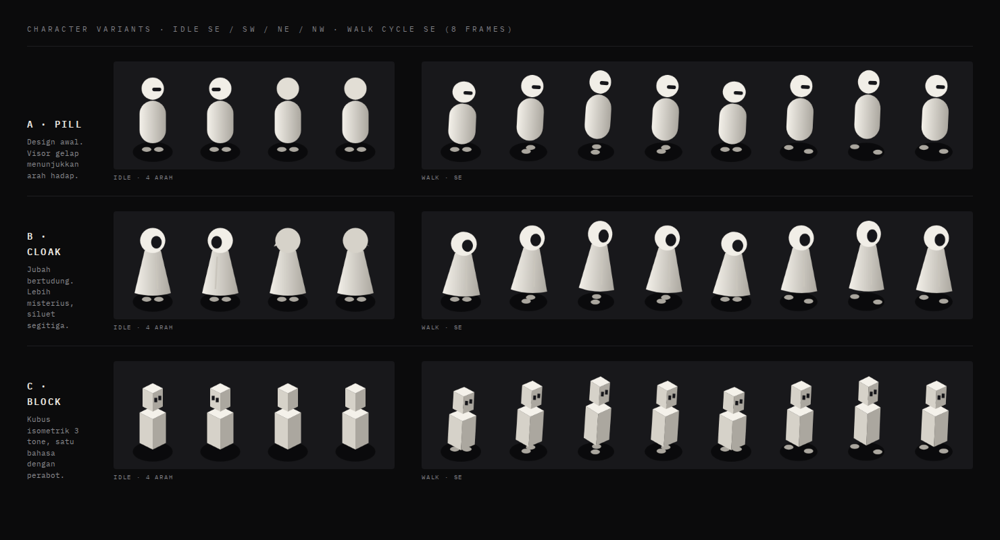
</p>

## Audio

**A lullaby that lies.** The game has one musical voice: a music-box tune
over a warm pad, friendly the way `I WILL HELP YOU.` is. As trust breaks,
the *same song* decays instead of being swapped for other music:

| Moment | Music |
| --- | --- |
| Menu, 01 | The lullaby. Once per loop one note sags out of tune, the musical "don't". |
| 02, `I LIED.` | Tape-stop: the song slows and pitch-dives to silence, and stays silent until `[ CONTINUE ]`. Then the same song returns sour, each phrase ending a semitone wrong. |
| 03 | Broken: bitcrushed fragments, stutters, dropouts over a dissonant drone. Glitch bursts make the music stumble. |
| 04 | Slower and lower, notes missing (it's listening), a soft pulse. |
| 05 | No music, only the room: "the game cannot control you if you stop listening". |
| 06–08 | Broken lullaby beneath the Archive routes. |
| 09–11 | Slower, lower notes in the Greenhouse. |
| 12–15 | The broken loop returns as the Tower timer tightens, then peaks in the Core. The room tone begins only after the final route. |
| Endings | TRUST cuts straight back to the lullaby. DON'T TRUST opens onto wind. TRUE: silence, then one pure chord, once. |

- **SFX:** 28 short sounds (UI clicks, typing ticks, steps, door, drawer,
  dial, key, crack, lie sting, glitches, transitions, pause). Rapid repeats
  are rate-limited.
- **REDUCE GLITCH:** no glitch sounds or music stumbles, and soft whooshes
  instead of the tear and light sounds.
- **Volume:** MUSIC and SFX are live (−3 dB per step). Tap the first cell
  again at 1 to mute.

All audio is original, synthesized by `tool/audio/generate_audio.py` from
oscillators and noise (no samples, fixed seeds). See
[`assets/audio/README.md`](assets/audio/README.md).

In the app (`lib/audio/`), the game only sends cues (`play(Sfx)`,
`mood(Mood)`, `tapeStop()` …) to `GameAudio`. `AudioDirector` turns them
into crossfades, ducking and cooldowns, and `SoloudBackend` plays them with
[flutter_soloud](https://pub.dev/packages/flutter_soloud). Tests run
silent.

## Project structure

| Path | What |
| --- | --- |
| `lib/room/` | The Flame world: 2:1 iso projection (`iso.dart`), the mutable `RoomScene`, and `RoomGame`: flat polygons, 3 tones per object, priority-sorted pieces, and the glitch layer (red ghost ±3px + offset horizontal slices). |
| `lib/game/game_controller.dart`, `route_challenge.dart` | The 15-stage story and data-driven route levels, on a pause-aware clock with obstacle-aware BFS, escalating timers, and three endings after stage 15. |
| `lib/game/overlays.dart` | Flutter overlays over the `GameWidget`: HUD, terminal, pause, drawer puzzle, log, truth choice, endings. |
| `lib/game/glitch.dart`, `transition_overlay.dart` | The glitch director and the stage transitions. |
| `lib/audio/` | Audio: cue catalog (`Sfx`, `Mood`), the `GameAudio` interface, `AudioDirector` (crossfades, tape-stop, ducking, cooldowns, settings) and the flutter_soloud backend. |
| `lib/screens/` | Main menu, boot/intro, gameplay, settings. |
| `lib/widgets/common.dart` | `DesignFrame` (lays out on the design's 360-wide canvas and scales to the device), bracket buttons, blinking cursor, scanlines. |
| `tool/` | Generators: sprite sheets, audio, app icon. |
| `docs/` | Character sheet, screenshots, audio design spec and plan. |

## Development

### Sprite sheets

`assets/images/sprites/player_<style>.png` + `player.json` (atlas: frame size,
anchor, rows = facings, idle/walk frame ranges and timing). Regenerate from the
painter with:

```sh
flutter test tool/generate_sprites.dart
```

Artists can replace the PNGs directly; the game reads frame counts and timing
from `player.json`, so a hand-drawn sheet with a different layout only needs the
JSON updated. Frames are drawn at 4× (128×192 px, feet at 64,168) and shown at
32×48 room units.

### Audio

To change a sound, edit `tool/audio/sfx.py` or `tool/audio/music.py` and
regenerate:

```sh
python -m venv tool/audio/.venv
tool/audio/.venv/Scripts/pip install -r tool/audio/requirements.txt   # bin/ on macOS/Linux
tool/audio/.venv/Scripts/python tool/audio/generate_audio.py           # or: … generate_audio.py click trust
tool/audio/.venv/Scripts/python -m unittest discover -s tool/audio
```

### App icon

`assets/icon/icon.png` (full icon: iOS, web, legacy Android) and
`assets/icon/icon_foreground.png` (Android adaptive foreground on `#0B0B0C`) are
rendered from SVG by `tool/render_icon.js`: the isometric room with its lit door and
a red glitch ghost. To regenerate:

```sh
node tool/render_icon.js            # needs playwright
dart run flutter_launcher_icons
git checkout ios/Runner.xcodeproj/project.pbxproj  # the tool wrongly edits a build flag there
```

### Splash screen

Plain `#0B0B0C` launch screen (same as the menu background) on Android (incl. the
Android 12+ splash API), iOS and web, generated by `flutter_native_splash`
(`dart run flutter_native_splash:create`). After regenerating, re-apply by hand:
Android `NormalTheme` `windowBackground` → `#0B0B0C` in the four `values*/styles.xml`
(otherwise a white frame shows between splash and Flutter), and the iOS
`LaunchScreen.storyboard` view background → dark.

### Screenshots

`docs/screenshots/` was captured from the release web build
(`flutter build web`) in Chrome at 360×760 @3x, by playing through the game,
then downscaled to 540 px wide. `hero.png` puts five of them side by side.

## Differences from the prototype

- The drawer puzzle and the `[ CONTINUE ] / [ LOG ]` dialogue step, shown as separate static screens in the design, are both part of stage 02 here.
- The scratched code sits left of the door, as `4·0·7·1`. In the prototype the door covered the "7".
- The secret-room wall lines are re-spaced and the left-wall lines wrapped, so they no longer overlap each other or the opening.
- IBM Plex Mono has no ▸ ▲ ▼ glyphs, so they are drawn as small triangles.
- Music and sound effects are original and generated in this repo (see [Audio](#audio)).

## Credits

- Design: a Claude Design handoff (`Dont Trust The Game.dc.html`).
- Fonts: IBM Plex Mono and Instrument Serif, both SIL OFL
  ([`assets/fonts/OFL.txt`](assets/fonts/OFL.txt)).
- Music and sound effects: original, synthesized in this repo.
